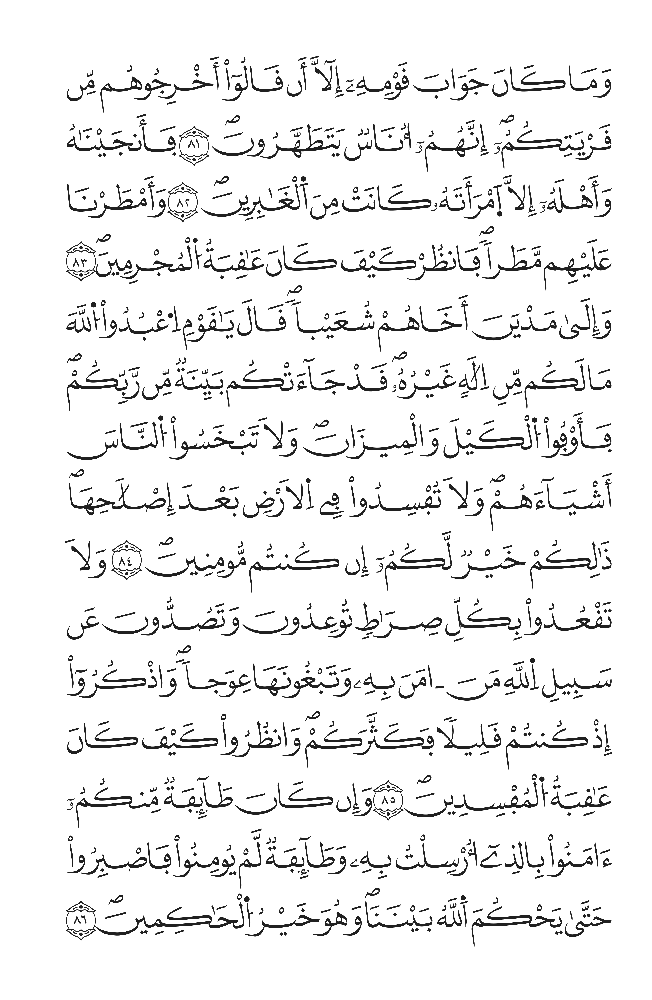
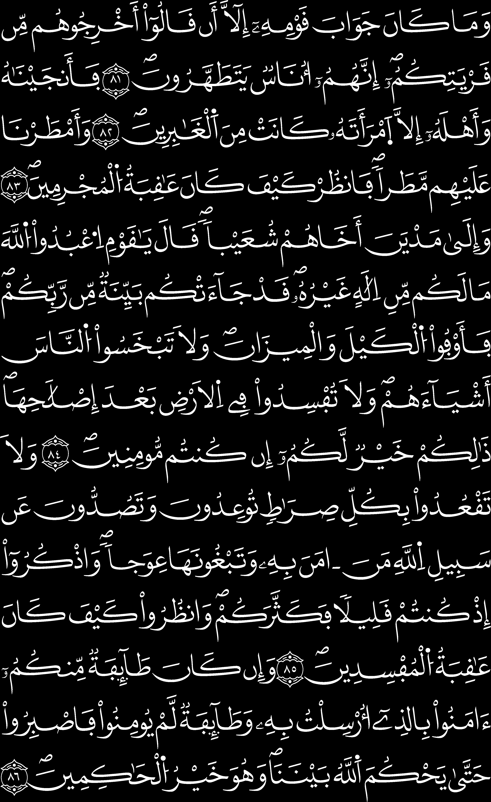
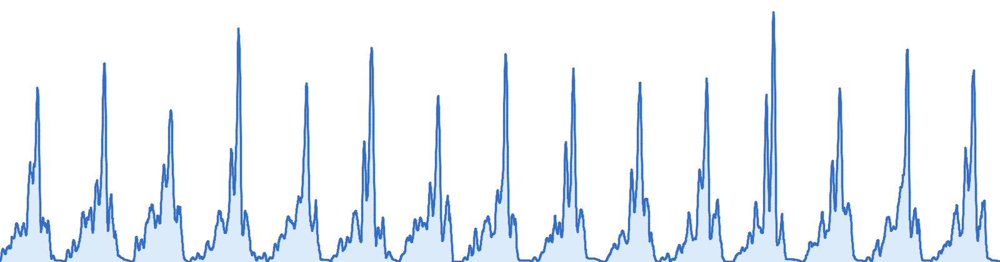
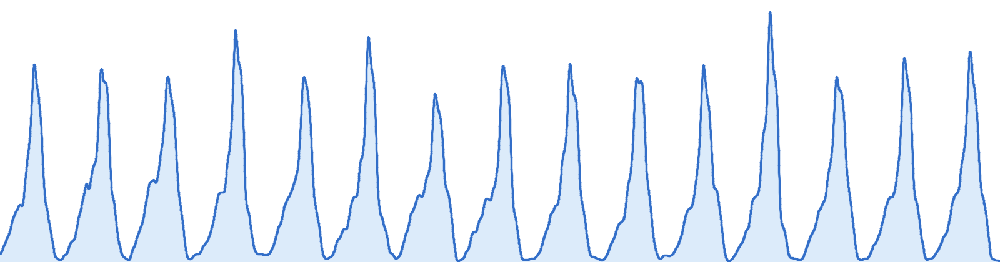
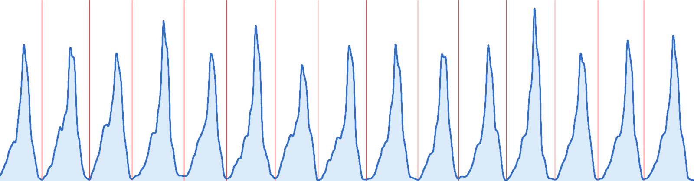

# Engines Flow

## Line engine

### Requirements (Inputs)

This engine requires the following

1. The mushaf pdf.

2. Range of pages.
    - Excluding any preceeding page or appendix pages. You will do this as in the very first step after uploading the pdf, in `SetUp` section of teh application.
    - Also, exclude surat al-fatiha and the very first page of surat al-baqarah as the engine is not cabable of processing them for some limitations. They are left to be processed manually.
    - You will provide the range in the `processing` section of the application.

3. The aya (sura, aya) from which the pages' range start.

4. sura_header template and aya_separator template:
    - sura_header template: An image containing the sura name with its decoration cut directly from the mushaf and from a sura other than al-fatiha or al-baqara (if they exist), since they are found to produce errors and bad scores during processing.
    - aya_separator template: An image containing the aya number with its decorated circle cut directly from the mushaf from any place.
    - The cut of each template should be done cleanly, without any extra ink around it, and no missed ink from it. White space are accepted.
    - This step will be done in the `Templates` section.
    - Optionaly, you can provide the area inside each tempalate which changes frequently, such as the aya number in the aya_separator, or the sura name in the sura_header. This will help the engine to focus on the static parts of the template and improve accuracy.

5. `bounds`: Which is the x, y, w, h of the text (content) area of the page. Ignoring any decorated borders and any decorations outside this box. The engine should process the text inside this box only plus the sura_header template of course.

6. `Lines/Page`: Home many lines of text are there in each page. This is used to validate the recognized rows.

7. `Header Slots`: How many lines the sura header spans. Most mushafs have 1 line, but some have two (e.g. the shamarli).

8. `Max headers/page`: The maximum number of sura headers that can appear in a single page. This is used to validate the recognized headers. Also, I didn't find any mushaf that has more or less than 3 haders in a single page as maximum.

9. `padding`: The extra space that will be added to the cut after the recognition of the text. This is used only to enhance the visual quality of the cut.

10. `header_threshold`: the sura_header template is used to scan the entire page, pixel by pixel, and get a score for each area it covers. The threshold is used to determine the minimum accepted score of the sura_header template to be considered a valid sura header.

11. `aya_threshold`: similar to the `header_threshold`, but for the aya_separator template. And it scans the each line not the entire page.

12. `alternate_margins`: After specifying the `bounds`, the engine will scan all the pages inside the specified bounds, so it will use it for all the pages not just the page you specified it from. But some mushafs have different margins for odd and even pages, mirrored margins, in which the left and right margins are different, and swaps their values in every page. So, set it true if the mushaf has this behavior, and false otherwise. This will help the engine to scan the pages correctly.

13. `prefer_acceleration`:  
    - The engine can use GPU acceleration to speed up the processing, but it is not always available. So, if you have a GPU and want to use it, set this to true. Otherwise, set it to false.
    - If you set it to true and the engine fails to use the GPU, it will fallback to CPU processing.
    - Using the GPU is faster but with an accuracy cost. The cost is nearly negligible, but it is still there. So, if you want the best accuracy, set it to false. But nothing is perfect so speed it up and fix the errors later manually, the accuracy is still above 95%.

### Flow

- The engine starts by preparing the template image by converting it to grayscale and binary (ink = 255, background = 0), and tightinging the image (to the sura header or the aya separator itself), removing any extra whitespace around it. And also prepare the variable area by preparing a mask of this area. All the data related to the template is carried by the dataclass [`TemplateSpec`](../backend/core/imaging/template_matching.py#48).

- The engine prepare the temaplates as part of the preparation step of the locators, [`SuraHeaderLocator`](../backend/core/page_detection/sura_header.py#L31) and [`AyaSeparatorProcessor`](../backend/core/page_detection/aya_separator.py#L28), which are the classes that handles this part of the job.

- The actuall processing starts in this block of code:

```python
output = pipeline.run(
    images,
    filenames=filenames,
    should_cancel=should_cancel,
    on_page_start=lambda index, _name: report("detecting", page_range_start + index - 1),
    on_page_done=persist,
)
```

Which is in [`pipeline.run`](../backend/api/services/processing.py#L84:L190).

> NOTE!
> There are some other preparations the code does, such as preparing the logging, openCV acceleration, and the progress reporting, and the cancellation of the processing, but they are not related to the actual processing of the pages, so I will not explain them here.

- The run starts by creating the tracker [`tracker`](../backend/core/page_detection/pipeline.py#L84) which is to number the swar and the ayat after detection the coordinates. IT is initialized by the provided aya (sura, aya) from which the pages' range start.

- Then, it starts the processing of the pages in a loop, page by page, building the context for each page, [`ctx`](../backend/core/page_detection/pipeline.py#L134). This context holds all the data required and all the data processed until the processing is done. Inside the context, it holds the source page image, its binary and greyscale np arrays,
 

- Then, it calls [`self.processor.process`](../backend/core/page_detection/pipeline.py#135), and for each page, it does the following:

- `process` method calls [`detect`](../backend/core/page_detection/page_processor.py#115) method.

- Inside the `detect` method, it makes sure that it is operating inside the content box of the page after using the bounds and the alternate_margins to determine the correct content box for the page.


- Then, it tightens the page to its content box,


- Detects the bands:

  There are two types of bands: sura header bands and text bands.

  Before detecting the text bands, it finds the sura header bands first.

  The sura header bands is detected as follows:

  - It scans the entire page with the sura_header tempalte using the `cv2.matchTemplate` method, and get the scores for each area it covers.

  - It filters the areas that have a score above the `header_threshold`.

  - Sorts the found areas by their score in descending order.

  - Then, it iterates over the found areas, and append the area to the list of found bands if it does not overlap with any of the already found bands. This is done to avoid duplicate detections of the same sura header and avoid same band positions (the band can gets accepted scores above and below itself by few rows, these are discarded in this loop).

  - It sorts the found bands by their y coordinate in ascending order.

  - The sura_header bands are stored in the context `ctx` in `sura_headers`.

    The text bands is detected as follows:

  - It finds the areas that are not reserved for the sura header bands, and considers them as text bands if they are above the minimum height of a text band (which is the height of a line multiplied by the number of lines per page).

  - It validates the overall height to make sure it doesn't pass the height of the page.

  After detecting the bands, it starts to iterate over the found bands, and for each band, it starts to detect the lines and split it as follows:

  - Calculates the sum of the pixels in each row of the band.

  - The result can be interpolated as a 1D signal, and the local minima of this signal are the lines' separators.
  

  - The resulted plot can look like a very rough signal, so it is smoothed using

    ```python
    def _smooth(profile: np.ndarray, kernel_size: int) -> np.ndarray:
        """Apply a small moving-average to reduce single-row noise."""
        kernel = np.ones(kernel_size) / kernel_size
        return np.convolve(profile, kernel, mode="same")
    ```

    

  - The local minima are detected using differentiation:

    ```python
    def _find_local_minima(profile: np.ndarray) -> list[int]:
        """Return indices of all local minima (strict descent then ascent)."""
        diff = np.diff(profile)
        # A minimum at i means: diff[i-1] <= 0 (descending/flat) AND
        # diff[i] >= 0 (ascending/flat), with at least one strict inequality.
        descending = diff[:-1] <= 0
        ascending = diff[1:] >= 0
        strict = (diff[:-1] < 0) | (diff[1:] > 0)
        mask = descending & ascending & strict
        # Offset by 1 because diff shifts indices
        return (np.where(mask)[0] + 1).tolist()  # type: ignore[no-any-return]
    ```

  - Calcluates the topographic prominence. For every candidate valley, the engine measures how deep it is relative to the surrounding peaks. A deep, well-defined valley is a stronger candidate for a line boundary than a shallow dip caused by ink variation inside a line.

  - Then, it sorts these local minima by their prominence in descending order, and keeps the top `Lines/Page - 1` local minima that doesn't overlap as the lines separators.
    

  - Finally, it maps the valleys back to original coordinates.

  After detection is done, all the found lines and headers are stored in the context `ctx` in `lines` where sura-header bands are stored as `LineResult` objects marked with `is_sura=True`; the export layer later represents them as `type="sura_header"`.

The engine then validates the number of found lines and headers to make sure they are exactly the number of lines per page (considering the header slots).

It then iterates over the found lines, and splits each line into segments (splits the line by the aya_separator) as follows:

- It cicks from [`self.aya_separator.split_segments(ctx)`](../backend/core/page_detection/page_processor.py#L181).

- If the line is a sura_header, skip it.

- Tightens the line to remove any extra whitespace around it. And if it results in an empty line, skip it.

- For a line whose content does not fill the full line box, separator detection is restricted to its trimmed content region. And if the trimmed content region is empty, skip it.

- Locate the aya_separator with the aya_separator template using `cv2.templateMatch()`. The flow is much the same as that of sura_header, finds the template mositions with scores, filter them by the `aya_threshold`, sort them by score, and filter the overlapping ones.


- Then, it splits the line into segments by the found aya_separator positions, and store them in the context `ctx` in `segments` under the line's index.

- Each segment is marked if it contains a separator or not for future use.

Then, comes the tracker, which is responsible for numbering the swar and the ayat after detection the coordinates. It is initialized by the provided aya (sura, aya) from which the pages' range start.

- It iterates over the lines, if the line is a sura_header, it increments the sura number and resets the aya number to 1. Of course there are some edge cases that are handled, such as we started from a sura header, and of course we specified the starting sura to be this one, and the aya to be 1.

- If the line is a text that doesn't contain a separator and comes directly after a sura_header, it is considered to be a basmala.

- Else, it is a normal text line, so it interates over its segments. This condition handles surat Al-tawbah correctly. Assigning the current aya number to the first segment, if the segment contians a separator, it increments the aya number and assigns it to the next segment, and so on.

Finally, the engine exports its results whether to the backend api or to a terminal or to an output file.

## Word Engine

The function [`detect_words`](../backend/core/word_boundary/engine.py#L44) is responsible for detecting the words in a given line. It takes the an instance of `WordBoundaryInput` and returns an instance of `WordBoundaryResult`.

### The `WordBoundaryInput` contains the following:

1. `lines`: which is a list of `LineImage` objects. which in turn contains the following:
    - `image`: a pillow image instance of the line.
    - `label`: the name of the image. Whether it is the image filename or it is generated from the page number and line number, it is used for logging and debugging purposes.
    - `source`: the source of the line. This could be the database (cut directly from the pdf using the data stored in the database after the page processing), a file, or any other source.
    - `separators`: a list of the x-positions `(x_start, x_end)` of the separators in the line. This makes use of the results from the line engine, where it already detected the separators positions. But if teh engine is used from different source, the separators attribute should be null, so that the engine knows that it should detect the separators itself.

2. `words`: a list of `WordInput` objects. Each `WordInput` contains the following:
    - `text`: the quranic uthmani word text itself. I used the one from tanzil.
    - `paws`: the number of disconnected ink blobs this spelling must produce. This is used to validate the detected words. It stands for "parts of a word". It is used to validate the detected words. For example, the word "الله" has 2 paws, while the word "الرحمن" has 3 paws.
    - `ijam_above`: the number of dots that floats above this word. For example, the word "الرحمن" has one dot above it, while the word "التين" has three dots above it.
    - `ijam_below`: the number of dots that floats below this word.
    - `aya`: the aya number this word belongs to. it takes the format "sura:aya".
    - `id`: the id of the word if it comes from the database, otherwise it is None. It is used to map the engine's output back to a row in the database.

3. `separator_template`: An instance of `PIL.Image` representing the template for the separators.

4. `ijam`: the ijam mode, which tells the engine whether to check them and report them or not. They may affect the accuracy of the engine later.

5. `symbol_templates`: a dictionary of symbol templates, such as the sajda symbol, and the quarter symbol.

### The flow of the engine is as follows:

1. The engine prepares the tempaltes, similar to the line engine.

2. It iterates over the lines, and for each line, it calls `analyse_line` function:

    - It starts by calling `load_ink` on the line image, which converts the image to a binary np array, where the ink is 255 and the background is 0.

    - Then, it tightens the line to remove any extra whitespace around it keeping only the content area. If the line is empty, it skips it. And stores the difference between the intial origin and the new origin in `offset_y` and `offset_x` to use them again when cutting after detection.

    - It calculates the sum of the pixels in each row, takes the max value and its index. The index is the index of what is called the "baseline" of the line, which is the row that contains the most ink, in other words, the line the writter uses to write the text on. Then, takes max value and calculates the floor value which I took as 30% of the max value. Then, the fucntion finds the row above and the row below of the baseline at which the sum reaches this floor value. The distance between these two rows is the <strong>"baseline band"</strong>.

    - Then, it calls `cv2.connectedComponentsWithStats` to find the connected components in the line returning teh number of found components, and the stats of each component, which contains the x, y, w, h, and area of each component.

    - It iterates over the found components, and creates a `Blob` instance for it. The `Blob` class contains the `x`, `y`, `w`, `h`, a `label`, and finally an attribute callled `preferred`.
    `preferred` is like a tag that each component get based on some criteria, as follows:
        - if the component crosses the baseline, it is marked as `preferred = "body"`.
        - else if it only crosses the band without the baseline itself, it is marked as `preferred = "mark"`
        - else it is marked as `preferred = "mark-only"`

    - Then, each component gets a score, as follows:
        - calculates the median of the areas of the components that are marked as `preferred = "body"`.
        - calculates how much of the component's height crosses the baseline band.
        - classify the component that are not marked as `preferred = "body"` if it is small for a body or not, by comparing it to the smallest area of the components that are marked as `preferred = "body"`.
        - Then it calculates the score using the following formula:

        ```python
          blob.body_score = round(
              SCORE_CROSSES_WRITING_LINE * (1.0 if blob.preferred == "body" else 0.0)
              + SCORE_BAND_OVERLAP * min(1.0, overlap / max(1, blob.h))
              + SCORE_RELATIVE_AREA * min(1.0, blob.area / max(1.0, typical_area))
              + SCORE_RELATIVE_HEIGHT * min(1.0, blob.h / band_height)
          )
          ```

          Where the constants are defined as follows:

          ```python
          SCORE_CROSSES_WRITING_LINE = 6
          SCORE_BAND_OVERLAP = 3
          SCORE_RELATIVE_AREA = 3
          SCORE_RELATIVE_HEIGHT = 2
          ```

  Then, it calls `split_symbols` function, which finds `(start_x, end_x)` of each symbol in the line, defines which blobs are actual text and which are marks, and if this is aya_separator, it specifies how many text blobs are before each separator.

  Gets `start_words` which is the indices of the words that begins each aya.

  Starts a cursor that points to the word in order.

  Then it comes the function `parse_line`, which takes `LineInk` instance which holds almost all the data we gathered regarding this line up to this point, `WordInput` isntance, the cursor, `aya_starts`, `ijam`, and `ornaments_before` which is how many ornaments precede this line in the span. It is used only to recover when the cursor has been lost altogether, where counting is the one thing left that still says which aya an ornament closes.

#### `parse_line` function flow:

1. It reads the components in order from right to left, then it splits the line into segments by the separators.

2. 
